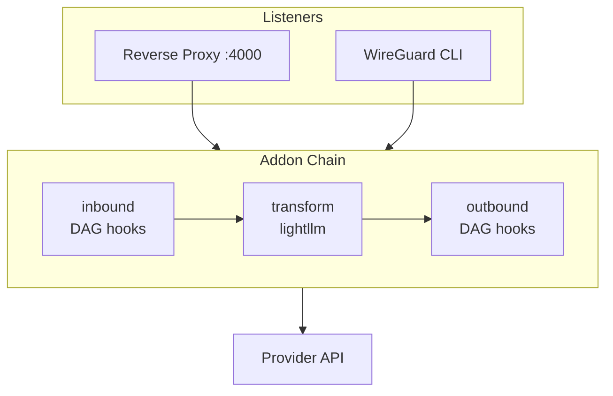

# `ccproxy` — CLI Proxy [](https://github.com/starbaser/ccproxy)

> [Discord](https://starbased.net/discord)

ccproxy is a transparent network interceptor for LLM tooling and AI harnesses,
built on mitmproxy and WireGuard with full TLS inspection and Wireshark keylog
export. Originally purpose-built for Claude Code, ccproxy now works with any LLM
client: Aider, Cursor, OpenAI SDK, or anything else that speaks HTTP. It jails a
process inside a rootless WireGuard namespace, intercepts at the network layer,
and feeds it through a DAG-driven pipeline that can decompose, transform, and
re-route traffic between providers.
Cross-provider request and response transformation is handled by `lightllm`, a
surgical connector into LiteLLM’s `BaseConfig` completion layer — no LiteLLM
proxy subprocess, no gateway server.

**New in 2.0 beta**: DeepSeek V4 routing support — redirect Anthropic-format
requests to DeepSeek’s `/anthropic/v1/messages` endpoint with a single transform
rule. See [Configuration](#configuration) for the routing setup.

The hook pipeline is your extension point for building mods and taking control
of your LLM usage while respecting terms of service:
- **Cross-provider routing**: redirect or transform requests between Anthropic,
  Gemini, OpenAI, DeepSeek, and any LiteLLM-supported provider.
- **Compliance shaping**: capture real SDK requests via WireGuard observation
  and stamp those compliance envelopes onto proxied requests, keeping you within
  provider terms of service.
- **MCP bridging**: add unsupported MCP features to any client:
  [sampling](https://modelcontextprotocol.io/specification/2025-11-25/client/sampling)
  via sentinel key detection,
  [server notifications](https://modelcontextprotocol.io/specification/2025-11-25/basic/index#notifications)
  bridged into the LLM context via ccproxy’s `/mcp` endpoint, and experimental
  [tasks](https://modelcontextprotocol.io/specification/2025-11-25/basic/utilities/tasks)
  support.

> Feedback and contributions welcome —
> [open an issue](https://github.com/starbaser/ccproxy/issues) or submit a PR.

## Installation

```bash
# Recommended: uv tool
uv tool install claude-ccproxy

# Alternative: pip
pip install claude-ccproxy
```

## Quick Start

```bash
# Initialize config template at ~/.config/ccproxy/ccproxy.yaml
ccproxy init

# Start the inspector server (foreground)
ccproxy start
```

**SDK use**: point any OpenAI-compatible client at the reverse proxy listener:

```bash
export ANTHROPIC_BASE_URL=http://localhost:4000
claude -p "hello"
```

**Transparent capture**: run a command inside the WireGuard namespace jail (all
traffic intercepted):

```bash
ccproxy run --inspect -- claude -p "hello"
```

## Architecture

Traffic enters through one of two listeners, passes through a fixed three-stage
addon chain, and exits directly to the provider API.


```mermaid
flowchart TD
    subgraph Listeners
        RP["Reverse Proxy :4000"]
        WG["WireGuard CLI"]
    end
    RP --> Chain
    WG --> Chain
    subgraph Chain["Addon Chain"]
        IN["inbound<br/>DAG hooks"] --> TX["transform<br/>lightllm"] --> OUT["outbound<br/>DAG hooks"]
    end
    Chain --> API["Provider API"]
```

**Addon chain** (fixed order):
`ReadySignal → InspectorAddon → MultiHARSaver → ShapeCapturer → inbound DAG → transform → outbound DAG → OAuthAddon → GeminiAddon`

`OAuthAddon` and `GeminiAddon` sit after the outbound pipeline so they see
ccproxy-finalized requests/responses. `OAuthAddon` owns 401-detect → refresh →
replay. `GeminiAddon` owns Gemini capacity fallback (sticky retry + fallback
chain on 429/503) and cloudcode-pa envelope unwrapping.

**lightllm** invokes LiteLLM’s `BaseConfig` transformation pipeline directly —
URL rewriting, auth signing, request/response format conversion — without the
proxy server, cost tracking, or callback machinery.

**SSE streaming**: `SseTransformer` handles cross-provider streaming by parsing
SSE events, transforming each chunk via LiteLLM’s per-provider
`ModelResponseIterator`, and re-serializing as OpenAI-format SSE.

## Configuration

`ccproxy init` writes a template to `~/.config/ccproxy/ccproxy.yaml`. Config is
also read from `$CCPROXY_CONFIG_DIR/ccproxy.yaml`.

```yaml
ccproxy:
  port: 4000

  # Provider entries keyed by sentinel suffix. The sentinel key
  # sk-ant-oat-ccproxy-{name} resolves to providers[name] for token
  # injection and routing.
  providers:
    anthropic:
      auth:
        type: command
        command: "jq -r '.claudeAiOauth.accessToken' ~/.claude/.credentials.json"
      host: api.anthropic.com
      path: /v1/messages
      provider: anthropic

    deepseek:
      auth:
        type: command
        command: "printenv DEEPSEEK_API_KEY"
        header: x-api-key
      host: api.deepseek.com
      path: /anthropic/v1/messages
      provider: anthropic

  hooks:
    inbound:
      - ccproxy.hooks.forward_oauth
      - ccproxy.hooks.extract_session_id
    outbound:
      - ccproxy.hooks.gemini_cli
      - ccproxy.hooks.inject_mcp_notifications
      - ccproxy.hooks.verbose_mode
      - ccproxy.hooks.shape
      - ccproxy.hooks.commitbee_compat

  inspector:
    # Optional regex-matched override rules layered on top of the
    # sentinel-driven providers map. Default is empty: most routing
    # comes from `providers` via forward_oauth's sentinel detection.
    transforms:
      - match_path: ^/v1/chat/completions
        match_model: ^gpt-4o
        action: transform
        dest_provider: anthropic
        dest_model: claude-haiku-4-5-20251001
```

**Transform matching**: `match_host` (optional regex, checked against
`pretty_host` + Host header + X-Forwarded-Host), `match_path` (regex,
default `.*`), `match_model` (regex, optional). First match wins.
Three actions: `redirect` (default — rewrite destination, preserve body),
`transform` (cross-format via lightllm), `passthrough` (forward unchanged).
Auth resolves through `dest_provider` → `providers[name]`.

### Auth source types

`Provider.auth` dispatches on `type:`. Two static loaders return whatever the
underlying source holds; two OAuth loaders own the refresh lifecycle in-process.

| `type` | What it is | When to use |
| --- | --- | --- |
| `command` | Run a shell command, return stdout | Static API keys, opnix/SOPS secret commands, env-var injection |
| `file` | Read a file, return contents | Static API keys stored in a managed secret file |
| `anthropic_oauth` | In-process Anthropic OAuth refresh | Share `~/.claude/.credentials.json` with Claude Code CLI |
| `google_oauth` | In-process Google/Gemini OAuth refresh | Share `~/.gemini/oauth_creds.json` with gemini-cli |

`command` and `file` are not OAuth — they have no expiry awareness and never
call out to a refresh endpoint. ccproxy reads them on every resolve; rotation
happens out-of-band through whichever secret manager produced the value.

`anthropic_oauth` and `google_oauth` extend the same `AuthSource` base. ccproxy
owns refresh end-to-end: when the cached access token is within 60 seconds of
expiry, ccproxy POSTs to the OAuth endpoint and atomically writes the new
tokens back to `file_path`. Three glom-configurable paths (`access_path`,
`refresh_path`, `expiry_path`) declare the credential JSON's schema, and
`copy.deepcopy` + `glom.assign(..., missing=dict)` keep sibling fields
(`scopes`, `subscriptionType`, etc.) intact.

A static API key for DeepSeek alongside an OAuth-refresh entry for Anthropic:

```yaml
ccproxy:
  providers:
    anthropic:
      auth:
        type: anthropic_oauth
        file_path: ~/.claude/.credentials.json
        access_path: claudeAiOauth.accessToken
        refresh_path: claudeAiOauth.refreshToken
        expiry_path: claudeAiOauth.expiresAt
        header: authorization
      host: api.anthropic.com
      path: /v1/messages
      provider: anthropic

    deepseek:
      auth:
        type: command
        command: "printenv DEEPSEEK_API_KEY"
        header: x-api-key
      host: api.deepseek.com
      path: /anthropic/v1/messages
      provider: anthropic
```

**Hook config**: hooks in each stage list are topologically sorted by
`@hook(reads=..., writes=...)` dependency declarations and executed in parallel
DAG order. Hooks can be parameterized:

```yaml
hooks:
  outbound:
    - hook: ccproxy.hooks.some_hook
      params:
        key: value
```

Per-request overrides via header: `x-ccproxy-hooks: +hook_name,-other_hook`.

### Sharing credentials with the Claude Code CLI

If you also run the Claude Code CLI on the same machine, point ccproxy's
`anthropic` provider at the CLI's own credential file. Both tools then read
*and* write the same JSON, so a refresh from either side is visible to the
other on the next read.

```yaml
ccproxy:
  providers:
    anthropic:
      auth:
        type: anthropic_oauth
        file_path: ~/.claude/.credentials.json
        access_path: claudeAiOauth.accessToken
        refresh_path: claudeAiOauth.refreshToken
        expiry_path: claudeAiOauth.expiresAt
        header: authorization
      host: api.anthropic.com
      path: /v1/messages
      provider: anthropic
```

The four glom paths declare the file's schema (`{claudeAiOauth: {accessToken,
refreshToken, expiresAt, ...}}`), so existing siblings the CLI maintains
(`scopes`, `subscriptionType`, etc.) are preserved on write. The atomic
write-back (tmpfile → fsync → rename → chmod 0600) keeps the file consistent
even if both tools refresh concurrently.

## Hook Pipeline

| Hook | Stage | Purpose |
| --- | --- | --- |
| `forward_oauth` | inbound | Sentinel key (`sk-ant-oat-ccproxy-{provider}`) substitution from `providers` |
| `extract_session_id` | inbound | Parses `metadata.user_id` → stores session_id on `flow.metadata` |
| `gemini_cli` | outbound | Single hook for Gemini sentinel-key traffic: `v1internal` envelope wrap, conditional UA masquerade, path rewrite to `cloudcode-pa`, and unwrap on the way back |
| `inject_mcp_notifications` | outbound | Injects buffered MCP terminal events as synthetic tool_use/tool_result |
| `verbose_mode` | outbound | Strips `redact-thinking-*` from `anthropic-beta` header |
| `shape` | outbound | Replays a captured shape and stamps content fields from the incoming request |
| `commitbee_compat` | outbound | Last-mile compatibility shim for commitbee |

## Shape Replay (Anthropic)

Anthropic traffic depends on a captured shape. The shape is the only source of
the Claude Code identity headers (user-agent, anthropic-beta, etc.) and the
billing-header block — there is no synthetic-identity fallback hook anymore. If
no shape exists for the `anthropic` provider, or if the captured shape is from
an outdated Claude CLI release, Anthropic will reject the request with 401/400.

Capture (and re-capture) a shape any time the Claude CLI version changes:

```bash
ccproxy flows shape --provider anthropic
```

## CLI Reference

```bash
ccproxy start                          # Start server (inspector mode, foreground)
ccproxy run [--inspect] -- <command>   # Run command with proxy env vars / WireGuard namespace jail
ccproxy status [--json]                # Show running state
ccproxy init [--force]                 # Initialize config in ~/.config/ccproxy/
ccproxy logs [-f] [-n LINES]           # View logs

# Flow inspection (all commands accept repeatable --jq filters)
ccproxy flows list [--json] [--jq FILTER]...     # List flow set
ccproxy flows dump [--jq FILTER]...              # Multi-page HAR of flow set
ccproxy flows diff [--jq FILTER]...              # Sliding-window diff across set
ccproxy flows compare [--jq FILTER]...           # Per-flow client-vs-forwarded diff
ccproxy flows clear [--all] [--jq FILTER]...     # Clear flow set (--all bypasses filters)
```

`ccproxy run` (without `--inspect`) sets `ANTHROPIC_BASE_URL`,
`OPENAI_BASE_URL`, and `OPENAI_API_BASE` in the subprocess environment and
routes traffic through the reverse proxy listener.

`ccproxy run --inspect` wraps the command in a rootless WireGuard network
namespace jail — all outbound traffic is transparently intercepted regardless of
SDK configuration.

## Inspecting Flows

All `flows` subcommands operate on a resolved **set** of flows.
The set is built by a pipeline:

```
GET /flows → config default_jq_filters → CLI --jq filters → final set
```

The `--jq` flag is repeatable.
Each filter must consume a JSON array and produce a JSON array.
Multiple filters chain via jq’s `|` operator:

```bash
# Only Anthropic API calls
ccproxy flows list --jq 'map(select(.request.pretty_host == "api.anthropic.com"))'

# Only POST /v1/messages
ccproxy flows list --jq 'map(select(.request.path | startswith("/v1/messages")))'

# Chain filters: Anthropic POSTs with 200 status
ccproxy flows list \
  --jq 'map(select(.request.pretty_host == "api.anthropic.com"))' \
  --jq 'map(select(.request.method == "POST"))' \
  --jq 'map(select(.response.status_code == 200))'
```

Config-level defaults apply before CLI filters, so you can set a baseline in
`ccproxy.yaml`:

```yaml
flows:
  default_jq_filters:
    - 'map(select(.request.path | startswith("/v1/messages")))'
```

### Listing flows

```bash
# Rich table (default)
ccproxy flows list

# Raw JSON
ccproxy flows list --json

# Filtered table
ccproxy flows list --jq 'map(select(.request.path | startswith("/v1/messages")))'
```

```
┏━━━━━━━━━━┳━━━━━━━━━┳━━━━━━━┳━━━━━━━━━━━┳━━━━━━━━━━━┳━━━━━━━━━━┳━━━━━━━━━━━━━━┓
┃ ID       ┃ Method  ┃  Code ┃ Host      ┃ Path      ┃ UA       ┃ Time         ┃
┡━━━━━━━━━━╇━━━━━━━━━╇━━━━━━━╇━━━━━━━━━━━╇━━━━━━━━━━━╇━━━━━━━━━━╇━━━━━━━━━━━━━━┩
│ 3c9c224c │ POST    │   200 │ api.anth… │ /v1/mess… │ claude-… │ 42 seconds   │
│          │         │       │           │           │ (extern… │ ago          │
│ 6cc161e9 │ POST    │   200 │ api.anth… │ /v1/mess… │ claude-… │ 29 seconds   │
│          │         │       │           │           │ (extern… │ ago          │
└──────────┴─────────┴───────┴───────────┴───────────┴──────────┴──────────────┘
```

### Diffing consecutive requests

`flows diff` performs a sliding-window unified diff over request bodies.
For a set `[f0, f1, f2]`, it produces diffs `f0→f1` and `f1→f2`. Requires at
least 2 flows.

```bash
ccproxy flows diff --jq 'map(select(.request.path | startswith("/v1/messages")))'
```

```diff
--- flow:3c9c224c
+++ flow:6cc161e9
@@ -26,7 +26,7 @@
         {
           "type": "text",
-          "text": "what's 2+2",
+          "text": "what's 3+3",
           "cache_control": {
```

### Comparing client vs forwarded requests

`flows compare` diffs the pre-pipeline client request against the post-pipeline
forwarded request for each flow.
This shows what ccproxy’s hook pipeline and lightllm transform actually changed.
Supports 1+ flows.

```bash
ccproxy flows compare --jq 'map(select(.request.path | startswith("/v1/messages")))'
```

When the pipeline rewrites the request (e.g. Anthropic → Gemini transform),
you’ll see URL changes and body diffs:

```
╭──────── URL change — abc12345 ────────╮
│ - https://api.anthropic.com/v1/messages│
│ + https://generativelanguage.googleapi…│
╰───────────────────────────────────────╯
╭──────── Body diff — abc12345 ─────────╮
│ --- client:abc12345                    │
│ +++ forwarded:abc12345                 │
│ @@ -1,5 +1,5 @@                       │
│ ...                                    │
╰───────────────────────────────────────╯
```

When no transform is applied (same-provider passthrough), the output confirms
the bodies are identical:

```
3c9c224c: request bodies are identical.
6cc161e9: request bodies are identical.
```

### Dumping HAR

`flows dump` exports the flow set as a multi-page HAR 1.2 file.
Each flow becomes one page with two entries:

| Entry | Content |
| --- | --- |
| `entries[2i]` | Forwarded request + upstream response |
| `entries[2i+1]` | Client request (pre-pipeline snapshot) + upstream response |

```bash
# Dump all flows to a HAR file (open in Chrome DevTools / Charles / Fiddler)
ccproxy flows dump > all.har

# Dump only LLM requests
ccproxy flows dump --jq 'map(select(.request.path | startswith("/v1/messages")))' > llm.har

# Query HAR with jq
ccproxy flows dump | jq '.log.pages | length'           # page count
ccproxy flows dump | jq '.log.entries[0].request.url'    # first forwarded URL
```

### Clearing flows

```bash
# Clear only matching flows (respects --jq filters)
ccproxy flows clear --jq 'map(select(.request.path | startswith("/v1/messages")))'
# => Cleared 2 flow(s).

# Clear everything (bypasses all filters)
ccproxy flows clear --all
```

## Development

```bash
git clone https://github.com/starbaser/ccproxy.git
cd ccproxy
direnv allow        # activates the nix devShell

just up             # start dev services (process-compose, detached, port 4001)
just down           # stop dev services
just test           # uv run pytest
just lint           # uv run ruff check .
just fmt            # uv run ruff format .
just typecheck      # uv run mypy src/ccproxy
```

The dev instance runs on port 4001 (production default: 4000). Inspector UI at
port 8083. Config and cert store at `.ccproxy/` inside the project directory.

## Troubleshooting

### Inspector prerequisites

The WireGuard namespace jail (`ccproxy run --inspect`) requires `slirp4netns`,
`wg`, `unshare`, `nsenter`, and `ip` to be available on `PATH`. On NixOS these
are provided by the devShell; on other systems install them via your package
manager.

### OAuth token errors

OAuth tokens are loaded at startup from each `providers[name].auth` source. If
a token command fails or returns an empty string, the sentinel key substitution
is skipped and the raw sentinel key is forwarded — which will be rejected by
the provider.
Verify your token command works standalone:

```bash
jq -r '.claudeAiOauth.accessToken' ~/.claude/.credentials.json
```

OAuth-source providers (`anthropic_oauth`, `google_oauth`) refresh in-process
via `AuthSource.resolve()` whenever the cached access token is within 60s of
expiry — this fires at startup (`_load_credentials()`) and on each header
injection. On a 401 from upstream, `OAuthAddon` re-resolves the credential
source and replays the request with the new token. Static `command` / `file`
loaders have no refresh capability — they read whatever's on disk every time
and rely on whichever secret manager owns rotation. Fix your `providers`
entries and restart `ccproxy start` if static tokens were stale at startup.

### TLS certificate errors in `ccproxy run`

`ccproxy run` (without `--inspect`) does not intercept TLS. It only sets env
vars pointing at the reverse proxy HTTP listener.
If the target tool performs its own TLS verification against the upstream API,
no cert installation is needed.

`ccproxy run --inspect` intercepts all traffic including TLS. The mitmproxy CA
is combined with system CAs and injected via `SSL_CERT_FILE`,
`NODE_EXTRA_CA_CERTS`, `REQUESTS_CA_BUNDLE`, and `CURL_CA_BUNDLE` into the
subprocess environment automatically.

If a tool still fails certificate verification, ensure the mitmproxy CA
(`~/.config/ccproxy/mitmproxy-ca-cert.pem`) is trusted by the tool’s runtime.
