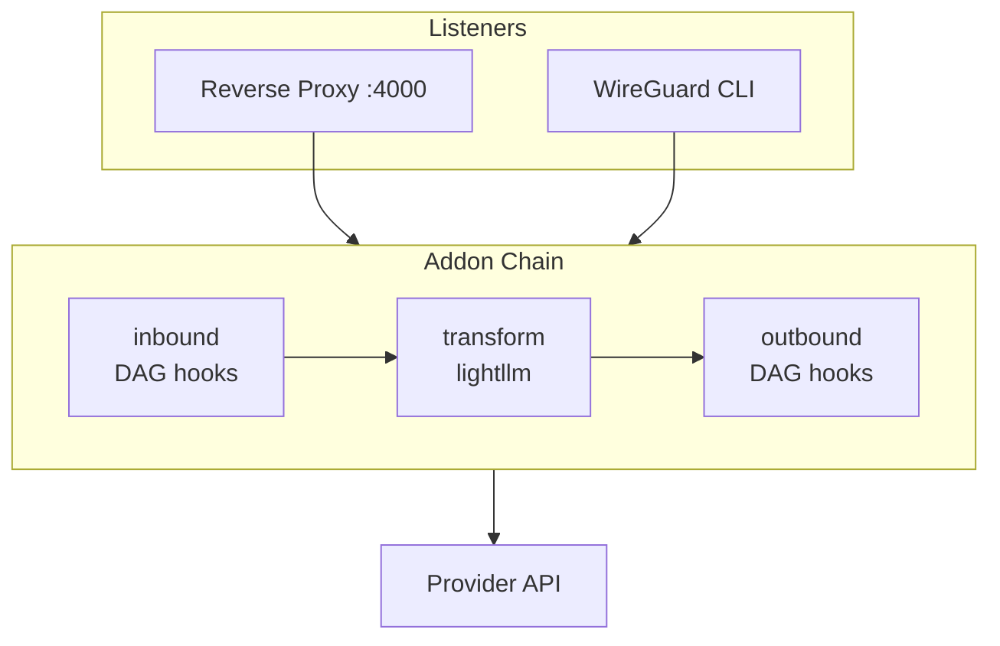

# ccproxy — Claude Code Proxy [](https://github.com/starbaser/ccproxy)

> [Discord](https://starbased.net/discord)

ccproxy is a mitmproxy-based transparent LLM API interceptor for Claude Code. It intercepts outbound API traffic, routes it through a DAG-driven hook pipeline, and forwards it directly to provider APIs after transforming requests and responses via `lightllm` — a surgical connector into LiteLLM's `BaseConfig` transformation layer. No LiteLLM proxy subprocess. No gateway server.

> Feedback and contributions welcome — [open an issue](https://github.com/starbaser/ccproxy/issues) or submit a PR.

## Installation

```bash
# Recommended: uv tool
uv tool install claude-ccproxy

# Alternative: pip
pip install claude-ccproxy
```

## Quick Start

```bash
# Create config template at ~/.ccproxy/ccproxy.yaml
ccproxy install

# Start the inspector server (foreground)
ccproxy start
```

**SDK use** — point any OpenAI-compatible client at the reverse proxy listener:

```bash
export ANTHROPIC_BASE_URL=http://localhost:4000
claude -p "hello"
```

**Transparent capture** — run a command inside the WireGuard namespace jail (all traffic intercepted):

```bash
ccproxy run --inspect -- claude -p "hello"
```

## Architecture

Traffic enters through one of two listeners, passes through a fixed three-stage addon chain, and exits directly to the provider API.


```mermaid
flowchart TD
    subgraph Listeners
        RP["Reverse Proxy :4000"]
        WG["WireGuard CLI"]
    end
    RP --> Chain
    WG --> Chain
    subgraph Chain["Addon Chain"]
        IN["inbound<br/>DAG hooks"] --> TX["transform<br/>lightllm"] --> OUT["outbound<br/>DAG hooks"]
    end
    Chain --> API["Provider API"]
```

**Addon chain** (fixed order): `ReadySignal → InspectorAddon → inbound DAG → transform → outbound DAG`

**lightllm** invokes LiteLLM's `BaseConfig` transformation pipeline directly — URL rewriting, auth signing, request/response format conversion — without the proxy server, cost tracking, or callback machinery.

**SSE streaming**: `SseTransformer` handles cross-provider streaming by parsing SSE events, transforming each chunk via LiteLLM's per-provider `ModelResponseIterator`, and re-serializing as OpenAI-format SSE.

## Configuration

`ccproxy install` writes a template to `~/.ccproxy/ccproxy.yaml`. Config is also read from `$CCPROXY_CONFIG_DIR/ccproxy.yaml`.

```yaml
ccproxy:
  port: 4000

  # OAuth token sources — map provider names to shell commands or file paths.
  # Tokens are substituted when the sentinel key sk-ant-oat-ccproxy-{provider} is used.
  oat_sources:
    anthropic:
      command: "jq -r '.claudeAiOauth.accessToken' ~/.claude/.credentials.json"

  hooks:
    inbound:
      - ccproxy.hooks.forward_oauth
      - ccproxy.hooks.extract_session_id
    outbound:
      - ccproxy.hooks.add_beta_headers
      - ccproxy.hooks.inject_claude_code_identity

  inspector:
    transforms:
      # Passthrough rules are checked first — matched hosts bypass transformation.
      - mode: passthrough
        match_host: cloudcode-pa.googleapis.com

      # Transform rules rewrite request/response to the destination provider.
      - match_path: /v1/chat/completions
        match_model: gpt-4o
        dest_provider: anthropic
        dest_model: claude-haiku-4-5-20251001
        dest_api_key_ref: anthropic
```

**Transform matching** — `match_host` (optional, checked against `pretty_host` + Host header), `match_path` (prefix), `match_model` (substring in request body). First match wins.

**Hook config** — hooks in each stage list are topologically sorted by `@hook(reads=..., writes=...)` dependency declarations and executed in DAG order. Hooks can be parameterized:

```yaml
hooks:
  outbound:
    - hook: ccproxy.hooks.some_hook
      params:
        key: value
```

Per-request overrides via header: `x-ccproxy-hooks: +hook_name,-other_hook`.

## Hook Pipeline

| Hook | Stage | Purpose |
|------|-------|---------|
| `forward_oauth` | inbound | Sentinel key (`sk-ant-oat-ccproxy-{provider}`) substitution from `oat_sources` |
| `extract_session_id` | inbound | Parses `metadata.user_id` → stores session_id on `flow.metadata` |
| `add_beta_headers` | outbound | Merges required `anthropic-beta` headers |
| `inject_claude_code_identity` | outbound | Prepends system prompt prefix for OAuth requests to Anthropic |
| `inject_mcp_notifications` | outbound | Injects buffered MCP terminal events as synthetic tool_use/tool_result |
| `verbose_mode` | outbound | Strips `redact-thinking-*` from `anthropic-beta` header |

## CLI Reference

```bash
ccproxy start                          # Start server (inspector mode, foreground)
ccproxy run [--inspect] -- <command>   # Run command with proxy env vars / WireGuard namespace jail
ccproxy status [--json]                # Show running state
ccproxy install [--force]              # Write template config to ~/.ccproxy/
ccproxy logs [-f] [-n LINES]           # View logs
```

`ccproxy run` (without `--inspect`) sets `ANTHROPIC_BASE_URL`, `OPENAI_BASE_URL`, and `OPENAI_API_BASE` in the subprocess environment and routes traffic through the reverse proxy listener.

`ccproxy run --inspect` wraps the command in a rootless WireGuard network namespace jail — all outbound traffic is transparently intercepted regardless of SDK configuration.

## Development

```bash
git clone https://github.com/starbaser/ccproxy.git
cd ccproxy
direnv allow        # activates the nix devShell

just up             # start dev services (process-compose, detached, port 4001)
just down           # stop dev services
just test           # uv run pytest
just lint           # uv run ruff check .
just fmt            # uv run ruff format .
just typecheck      # uv run mypy src/ccproxy
```

The dev instance runs on port 4001 (production default: 4000). Inspector UI at port 8083. Config and cert store at `.ccproxy/` inside the project directory.

## Troubleshooting

### Inspector prerequisites

The WireGuard namespace jail (`ccproxy run --inspect`) requires `slirp4netns`, `wg`, `unshare`, `nsenter`, and `ip` to be available on `PATH`. On NixOS these are provided by the devShell; on other systems install them via your package manager.

### OAuth token errors

OAuth tokens are loaded at startup from `oat_sources`. If a token command fails or returns an empty string, the sentinel key substitution is skipped and the raw sentinel key is forwarded — which will be rejected by the provider. Verify your token command works standalone:

```bash
jq -r '.claudeAiOauth.accessToken' ~/.claude/.credentials.json
```

Tokens are refreshed automatically (TTL-based every 30 min, immediate on 401). Set `oat_sources` correctly and restart `ccproxy start` if tokens were stale at startup.

### TLS certificate errors in `ccproxy run`

`ccproxy run` (without `--inspect`) does not intercept TLS — it only sets env vars pointing at the reverse proxy HTTP listener. If the target tool performs its own TLS verification against the upstream API, no cert installation is needed.

`ccproxy run --inspect` intercepts all traffic including TLS. The mitmproxy CA is combined with system CAs and injected via `SSL_CERT_FILE`, `NODE_EXTRA_CA_CERTS`, `REQUESTS_CA_BUNDLE`, and `CURL_CA_BUNDLE` into the subprocess environment automatically.

If a tool still fails certificate verification, ensure the mitmproxy CA (`~/.ccproxy/mitmproxy-ca-cert.pem`) is trusted by the tool's runtime.
