# `ccproxy` - Claude Code Proxy [](https://github.com/starbased-co/ccproxy)

> [Join starbased HQ](https://discord.gg/HDuYQAFsbw) for questions, sharing setups, and contributing to development.

`ccproxy` is a development platform for extending and customizing Claude Code. It intercepts requests through a [LiteLLM Proxy Server](https://docs.litellm.ai/docs/simple_proxy), enabling intelligent routing to different LLM providers based on request characteristics—token count, model type, tool usage, or custom rules.

Route large contexts to Gemini's 2M token window, send web searches to Perplexity, or apply custom preprocessing logic—all transparently to Claude Code.

> ⚠️ **Note**: While core functionality is complete, real-world testing and community input are welcomed. Please [open an issue](https://github.com/starbased-co/ccproxy/issues) to share your experience, report bugs, or suggest improvements, or even better, submit a PR!

## Installation

**Important:** ccproxy must be installed with LiteLLM in the same environment so that LiteLLM can import the ccproxy handler.

### Recommended: Install as uv tool

```bash
# Install from PyPI
uv tool install claude-ccproxy --with 'litellm[proxy]'

# Or install from GitHub (latest)
uv tool install git+https://github.com/starbased-co/ccproxy.git --with 'litellm[proxy]'
```

This installs:

- `ccproxy` command (for managing the proxy)
- `litellm` bundled in the same environment (so it can import ccproxy's handler)

### Alternative: Install with pip

```bash
# Install both packages in the same virtual environment
pip install git+https://github.com/starbased-co/ccproxy.git
pip install 'litellm[proxy]'
```

**Note:** With pip, both packages must be in the same virtual environment.

### Verify Installation

```bash
ccproxy --help
# Should show ccproxy commands

which litellm
# Should point to litellm in ccproxy's environment
```

## Usage

Run the automated setup:

```bash
# This will create all necessary configuration files in ~/.ccproxy
ccproxy install

tree ~/.ccproxy
# ~/.ccproxy
# ├── ccproxy.yaml
# └── config.yaml

# ccproxy.py is auto-generated when you start the proxy

# Start the proxy server
ccproxy start --detach

# Start Claude Code
ccproxy run claude
# Or add to your .zshrc/.bashrc
export ANTHROPIC_BASE_URL="http://localhost:4000"
# Or use an alias
alias claude-proxy='ANTHROPIC_BASE_URL="http://localhost:4000" claude'
```

Congrats, you have installed `ccproxy`! The installed configuration files are intended to be a simple demonstration, thus continuing on to the next section to configure `ccproxy` is **recommended**.

### Configuration

#### `ccproxy.yaml`

This file controls how `ccproxy` hooks into your Claude Code requests and how to route them to different LLM models based on rules. Here you specify rules, their evaluation order, and criteria like token count, model type, or tool usage.

```yaml
ccproxy:
  debug: true

  # OAuth token sources - map provider names to shell commands
  # Tokens are loaded at startup for SDK/API access outside Claude Code
  oat_sources:
    anthropic: "jq -r '.claudeAiOauth.accessToken' ~/.claude/.credentials.json"
    # Extended format with custom User-Agent:
    # gemini:
    #   command: "jq -r '.token' ~/.gemini/creds.json"
    #   user_agent: "MyApp/1.0"

  hooks:
    - ccproxy.hooks.rule_evaluator    # evaluates rules against request (needed for routing)
    - ccproxy.hooks.model_router      # routes to appropriate model
    - ccproxy.hooks.forward_oauth     # forwards OAuth token to provider
    - ccproxy.hooks.extract_session_id  # extracts session ID for LangFuse tracking
    # - ccproxy.hooks.capture_headers  # logs HTTP headers (with redaction)
    # - ccproxy.hooks.forward_apikey   # forwards x-api-key header
  rules:
    # example rules
    - name: token_count
      rule: ccproxy.rules.TokenCountRule
      params:
        - threshold: 60000
    - name: web_search
      rule: ccproxy.rules.MatchToolRule
      params:
        - tool_name: WebSearch
    # basic rules
    - name: background
      rule: ccproxy.rules.MatchModelRule
      params:
        - model_name: claude-3-5-haiku-20241022
    - name: think
      rule: ccproxy.rules.ThinkingRule

litellm:
  host: 127.0.0.1
  port: 4000
  num_workers: 4
  debug: true
  detailed_debug: true
```

When `ccproxy` receives a request from Claude Code, the `rule_evaluator` hook labels the request with the first matching rule:

1. `MatchModelRule`: A request with `model: claude-3-5-haiku-20241022` is labeled: `background`
2. `ThinkingRule`: A request with `thinking: {enabled: true}` is labeled: `think`

If a request doesn't match any rule, it receives the `default` label.

#### `config.yaml`

[LiteLLM's proxy configuration file](https://docs.litellm.ai/docs/proxy/config_settings) is where your model deployments are defined. The `model_router` hook takes advantage of [LiteLLM's model alias feature](https://docs.litellm.ai/docs/completion/model_alias) to dynamically rewrite the model field in requests based on rule criteria before LiteLLM selects a deployment. When a request is labeled (e.g., think), the hook changes the model from whatever Claude Code requested to the corresponding alias, allowing seamless redirection to different models.

The diagram shows how routing labels (⚡ default, 🧠 think, 🍃 background) map to their corresponding model deployments:

```mermaid
graph LR
    subgraph ccproxy_yaml["<code>ccproxy.yaml</code>"]
        R1["<div style='text-align:left'><code>rules:</code><br/><code>- name: default</code><br/><code>- name: think</code><br/><code>- name: background</code></div>"]
    end

    subgraph config_yaml["<code>config.yaml</code>"]
        subgraph aliases[" "]
            A1["<div style='text-align:left'><code>model_name: default</code><br/><code>litellm_params:</code><br/><code>&nbsp;&nbsp;model: claude-sonnet-4-5-20250929</code></div>"]
            A2["<div style='text-align:left'><code>model_name: think</code><br/><code>litellm_params:</code><br/><code>&nbsp;&nbsp;model: claude-opus-4-5-20251101</code></div>"]
            A3["<div style='text-align:left'><code>model_name: background</code><br/><code>litellm_params:</code><br/><code>&nbsp;&nbsp;model: claude-3-5-haiku-20241022</code></div>"]
        end

        subgraph models[" "]
            M1["<div style='text-align:left'><code>model_name: claude-sonnet-4-5-20250929</code><br/><code>litellm_params:</code><br/><code>&nbsp;&nbsp;model: anthropic/claude-sonnet-4-5-20250929</code></div>"]
            M2["<div style='text-align:left'><code>model_name: claude-opus-4-5-20251101</code><br/><code>litellm_params:</code><br/><code>&nbsp;&nbsp;model: anthropic/claude-opus-4-5-20251101</code></div>"]
            M3["<div style='text-align:left'><code>model_name: claude-3-5-haiku-20241022</code><br/><code>litellm_params:</code><br/><code>&nbsp;&nbsp;model: anthropic/claude-3-5-haiku-20241022</code></div>"]
        end
    end

    R1 ==>|"⚡ <code>default</code>"| A1
    R1 ==>|"🧠 <code>think</code>"| A2
    R1 ==>|"🍃 <code>background</code>"| A3

    A1 -->|"<code>alias</code>"| M1
    A2 -->|"<code>alias</code>"| M2
    A3 -->|"<code>alias</code>"| M3

    style R1 fill:#e6f3ff,stroke:#4a90e2,stroke-width:2px,color:#000

    style A1 fill:#fffbf0,stroke:#ffa500,stroke-width:2px,color:#000
    style A2 fill:#fff0f5,stroke:#ff1493,stroke-width:2px,color:#000
    style A3 fill:#f0fff0,stroke:#32cd32,stroke-width:2px,color:#000

    style M1 fill:#f8f9fa,stroke:#6c757d,stroke-width:1px,color:#000
    style M2 fill:#f8f9fa,stroke:#6c757d,stroke-width:1px,color:#000
    style M3 fill:#f8f9fa,stroke:#6c757d,stroke-width:1px,color:#000

    style aliases fill:#f0f8ff,stroke:#333,stroke-width:1px
    style models fill:#f5f5f5,stroke:#333,stroke-width:1px
    style ccproxy_yaml fill:#e8f4fd,stroke:#2196F3,stroke-width:2px
    style config_yaml fill:#ffffff,stroke:#333,stroke-width:2px
```



And the corresponding `config.yaml`:

```yaml
# config.yaml
model_list:
  # aliases here are used to select a deployment below
  - model_name: default
    litellm_params:
      model: claude-sonnet-4-5-20250929

  - model_name: think
    litellm_params:
      model: claude-opus-4-5-20251101

  - model_name: background
    litellm_params:
      model: claude-3-5-haiku-20241022

  # deployments
  - model_name: claude-sonnet-4-5-20250929
    litellm_params:
      model: anthropic/claude-sonnet-4-5-20250929
      api_base: https://api.anthropic.com

  - model_name: claude-opus-4-5-20251101
    litellm_params:
      model: anthropic/claude-opus-4-5-20251101
      api_base: https://api.anthropic.com

  - model_name: claude-3-5-haiku-20241022
    litellm_params:
      model: anthropic/claude-3-5-haiku-20241022
      api_base: https://api.anthropic.com

litellm_settings:
  callbacks:
    - ccproxy.handler
general_settings:
  forward_client_headers_to_llm_api: true
```

See [docs/configuration.md](docs/configuration.md) for more information on how to customize your Claude Code experience using `ccproxy`.

<!-- ## Extended Thinking -->

<!-- Normally, when you send a message, Claude Code does a simple keyword scan for words/phrases like "think deeply" to determine whether or not to enable thinking, as well the size of the thinking token budget. [Simply including the word "ultrathink](https://claudelog.com/mechanics/ultrathink-plus-plus/) sets the thinking token budget to the maximum of `31999`. -->

## Routing Rules

`ccproxy` provides several built-in rules as an homage to [claude-code-router](https://github.com/musistudio/claude-code-router):

- **MatchModelRule**: Routes based on the requested model name
- **ThinkingRule**: Routes requests containing a "thinking" field
- **TokenCountRule**: Routes requests with large token counts to high-capacity models
- **MatchToolRule**: Routes based on tool usage (e.g., WebSearch)

See [`rules.py`](src/ccproxy/rules.py) for implementing your own rules.

Custom rules (and hooks) are loaded with the same mechanism that LiteLLM uses to import the custom callbacks, that is, they are imported as by the LiteLLM python process as named module from within it's virtual environment (e.g. `import custom_rule_file.custom_rule_function`), or as a python script adjacent to `config.yaml`.

## Hooks

Hooks are functions that process requests at different stages. Configure them in `ccproxy.yaml`:

| Hook | Description |
|------|-------------|
| `rule_evaluator` | Evaluates rules and labels requests for routing |
| `model_router` | Routes requests to appropriate model based on labels |
| `forward_oauth` | Forwards OAuth tokens to providers (supports multi-provider with custom User-Agent) |
| `forward_apikey` | Forwards `x-api-key` header to proxied requests |
| `extract_session_id` | Extracts session ID from Claude Code's `user_id` for LangFuse tracking |
| `capture_headers` | Logs HTTP headers as LangFuse trace metadata (with sensitive value redaction) |

Hooks can accept parameters via configuration:

```yaml
hooks:
  - hook: ccproxy.hooks.capture_headers
    params:
      - headers: ["user-agent", "x-request-id"]  # Optional: filter specific headers
```

See [`hooks.py`](src/ccproxy/hooks.py) for implementing custom hooks.

## CLI Commands

`ccproxy` provides several commands for managing the proxy server:

```bash
# Install configuration files
ccproxy install [--force]

# Start LiteLLM
ccproxy start [--detach]

# Stop LiteLLM
ccproxy stop

# Check proxy server status (includes url field for tool detection)
ccproxy status         # Human-readable output
ccproxy status --json  # JSON output with url field

# View proxy server logs
ccproxy logs [-f] [-n LINES]

# Run any command with proxy environment variables
ccproxy run <command> [args...]
```

After installation and setup, you can run any command through the `ccproxy`:

```bash
# Run Claude Code through the proxy
ccproxy run claude --version
ccproxy run claude -p "Explain quantum computing"

# Run other tools through the proxy
ccproxy run curl http://localhost:4000/health
ccproxy run python my_script.py

```

The `ccproxy run` command sets up the following environment variables:

- `ANTHROPIC_BASE_URL` - For Anthropic SDK compatibility
- `OPENAI_API_BASE` - For OpenAI SDK compatibility
- `OPENAI_BASE_URL` - For OpenAI SDK compatibility

## Development

### Request Lifecycle

```mermaid
sequenceDiagram
    participant CC as cli app
    participant CP as litellm request → ccproxy
    participant LP as ccproxy ← litellm response
    participant API as api.anthropic.com

    Note over CC,API: Request Flow
    CC->>CP: API Request<br/>(messages, model, tools, etc.)
    Note over CP,LP: <Add hooks in any working order here>

    Note right of CP: ccproxy.hooks.rule_evaluator
    CP-->>CP: ↓
    Note right of CP: ccproxy.hooks.model_router
    CP-->>CP: ↓
    Note right of CP: ccproxy.hooks.forward_oauth
    CP-->>CP: ↓
    Note right of CP: <Your code here>
    CP->>API: LiteLLM: Outbound Modified Provider-specific Request

    Note over CC,API: Response Flow (Streaming)
    API-->>LP: Streamed Response
    Note right of CP: First to see response<br/>Can modify/hook into stream
    LP-->>CC: Streamed Response<br/>(forwarded to cli app)
```



### Local Setup

When developing ccproxy locally:

```bash
cd /path/to/ccproxy

# Install in editable mode with litellm bundled
# Changes to source code are reflected immediately without reinstalling
uv tool install --editable . --with 'litellm[proxy]' --force

# Restart the proxy to pick up code changes
ccproxy stop
ccproxy start --detach

# Run tests
uv run pytest

# Linting & formatting
uv run ruff format .
uv run ruff check --fix .
```

The `--editable` flag enables live code changes without reinstallation. The handler file (`~/.ccproxy/ccproxy.py`) is automatically regenerated on every `ccproxy start`.

**Note:** Custom `ccproxy.py` files are preserved - auto-generation only overwrites files containing the `# AUTO-GENERATED` marker.

## Troubleshooting

### ImportError: Could not import handler from ccproxy

**Symptom:** LiteLLM fails to start with import errors like:

```
ImportError: Could not import handler from ccproxy
```

**Cause:** LiteLLM and ccproxy are in different isolated environments.

**Solution:** Reinstall ccproxy with litellm bundled:

```bash
# Using uv tool (from PyPI)
uv tool install claude-ccproxy --with 'litellm[proxy]' --force

# Or from GitHub (latest)
uv tool install git+https://github.com/starbased-co/ccproxy.git --with 'litellm[proxy]' --force

# Or for local development (editable mode)
cd /path/to/ccproxy
uv tool install --editable . --with 'litellm[proxy]' --force
```

### Handler Configuration Not Updating

**Symptom:** Changes to `handler` field in `ccproxy.yaml` don't take effect.

**Cause:** Handler file is only regenerated on `ccproxy start`.

**Solution:**

```bash
ccproxy stop
ccproxy start --detach
# This regenerates ~/.ccproxy/ccproxy.py
```

### Verifying Installation

Check that ccproxy is accessible to litellm:

```bash
# Find litellm's environment
which litellm

# Check if ccproxy is installed in the same environment
$(dirname $(which litellm))/python -c "import ccproxy; print(ccproxy.__file__)"
# Should print path without errors
```

## Contributing

I welcome contributions! Please see the [Contributing Guide](CONTRIBUTING.md) for details on:

- Reporting issues and asking questions
- Setting up development environment
- Code style and testing requirements
- Submitting pull requests

Since this is a new project, I especially appreciate:

- Bug reports and feedback
- Documentation improvements
- Test coverage additions
- Feature suggestions
- Any of your implementations using `ccproxy`
